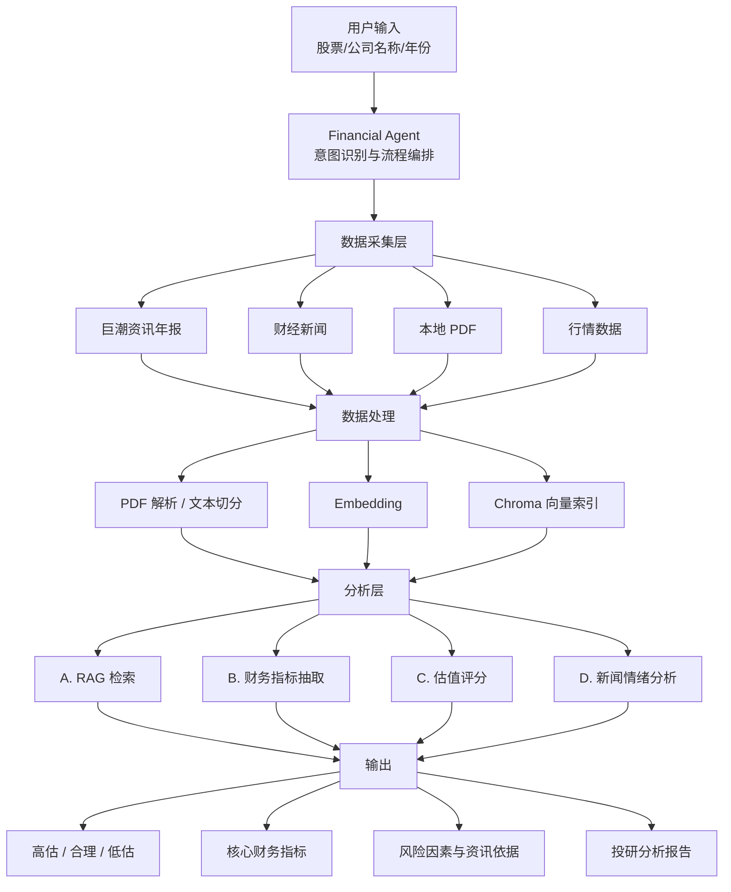

# Financial Research Agent
（金融投研智能体 PoC）

面向**股票研究场景**的 AI Agent 系统，用于辅助投研人员快速完成：财报解析、资讯整合、指标抽取与规则估值研判。

本项目不是简单的聊天机器人，而是一条可运行的投研流水线：从「公司名 / 年份」输入，到结构化投研报告输出。

**支持能力：**
- 财报 PDF 自动解析（可手动上传，也可按公司名+年份自动检索巨潮年报）
- 财经新闻处理与个股资讯抓取
- 金融文本 RAG 检索
- 财务指标提取
- 规则驱动估值分析
- 自动生成投研分析报告

**不配置任何 LLM / Cursor API 也可运行**（检索、指标抽取、估值结论基于本地规则与向量检索）。  
LLM / Cursor 仅作为可选增强，用于自然语言问答与解读。

---

## 安全须知（必读）

**千万不要把 API Key（如 OpenAI、DeepSeek、Cursor 等）硬编码进代码或提交到 GitHub。**

正确做法：从环境变量 / `.env` 读取：

```python
import os

api_key = os.getenv("OPENAI_API_KEY")
```

本仓库通过 `python-dotenv` 加载项目根目录 `.env`（见 `config.py`）。  
**运行时请在 `.env` 文件中配置你的 API Key**（可复制 `.env.example` 后填写）。

- `.env` 已加入 `.gitignore`，**不要** `git add .env`
- 仓库只提供 `.env.example` 模板（不含真实密钥）

---

## 系统架构

用户输入股票名称 / 公司名称 / 年份后，由 Financial Agent 调度数据采集、处理、分析，并输出投研结论。



---

## 估值模块说明

估值判断目前采用**规则驱动**方法，综合财务指标、估值指标和市场情绪进行评分。  
未来可接入机器学习模型进行预测优化。

> 说明：当前实现是可解释的规则评分，**不是**收益预测模型，也不构成投资建议。

### 综合评分维度（示意）

**盈利能力**
- ROE
- 净利润增长率
- 营收增长率

**估值水平**
- PE
- PB
- 相对行业 / 历史估值位置（规则区间对比）

**市场因素**
- 新闻情绪
- 风险事件 / 负面资讯

### 结论映射（示意）

| 综合表现 | 结论 |
|----------|------|
| 评分偏强（示意：80 分以上） | 偏低估 |
| 中性区间（示意：60–80） | 合理估值 |
| 评分偏弱（示意：60 以下） | 偏高估 |

实际输出以系统五段式报告中的「高估 / 合理 / 低估」及依据列表为准。

---

## 快速开始

### 1. 安装

```powershell
cd financial-poc
python -m venv .venv
.\.venv\Scripts\Activate.ps1
pip install -r requirements.txt
copy .env.example .env
```

按需编辑 `.env`（无 Key 也可先跑规则分析与网页 Agent）。

### 2. 启动网页 Agent（推荐）

```powershell
uvicorn api.main:app --reload --host 127.0.0.1 --port 8000
```

浏览器打开：http://127.0.0.1:8000/agent

**Windows 快捷方式（可选）：** 双击项目根目录 `启动网页Agent.bat`  
（仍建议掌握上面的 `uvicorn` 命令，不依赖 bat。）

### 3. 终端 Agent（可选）

```powershell
python scripts/agent.py
python scripts/agent.py analyze 贵州茅台
```

---

## Demo 示例

**输入**

```text
贵州茅台 2024
```

**输出示例（示意）**

```text
公司：贵州茅台

财务表现：
- 营业收入、净利润保持稳健增长
- ROE 维持较高水平

估值：
- PE / PB 处于白酒行业常见区间附近
- 相对同业对比给出横向参考

新闻情绪：
- 近期资讯偏中性至正面（如提价、经营动态等）

综合评分：
- 规则评分落在中性区间

结论：
- 合理估值

（完整输出为五段式投研报告：估值结论、核心指标、关键词、行情对比、资讯与依据）
```

领导可通过该示例快速理解产品效果：输入公司与年份 → 自动取数与分析 → 得到可解释的投研结论。

---

## 环境变量（`.env`）

```powershell
copy .env.example .env
```

常用项：

```env
# —— 规则分析即可，无需 Key ——
FINANCIAL_POC_AGENT_ENABLE_LLM=false

# —— 可选：Cursor 自然语言解读 ——
CURSOR_API_KEY=
FINANCIAL_POC_CURSOR_NARRATIVE=true

# —— 可选：LLM 问答 ——
LLM_PROVIDER=deepseek
OPENAI_API_KEY=
DEEPSEEK_API_KEY=
QWEN_API_KEY=
```

- **不填 Key**：五段式分析、检索、估值仍可用  
- **填 Cursor / LLM Key**：可选增强自然语言解读与问答  

---

## 目录结构

```text
api/                 FastAPI 接口与网页 Agent
web/                 前端页面
src/agent/           Agent 流程控制、意图识别
src/analysis/        财务分析、估值评分
src/financial/       财务指标抽取、估值计算
src/collectors/      PDF、新闻、数据采集
src/pipelines/       文档处理与向量索引
scripts/             CLI 入口
```

---

## 常用命令

| 命令 | 作用 |
|------|------|
| `uvicorn api.main:app --reload --host 127.0.0.1 --port 8000` | 网页 Agent |
| `启动网页Agent.bat` | Windows 一键启动（可选） |
| `python scripts/agent.py` | 终端对话 Agent |
| `python scripts/agent.py analyze 公司名` | 单次全量分析 |
| `python scripts/agent.py query "..."` | 单次财报检索 |
| `python scripts/agent.py pdf` | 处理本地 PDF |
| `python scripts/agent.py sync --skip-fetch` | 同步本地数据到索引 |
| `python scripts/agent.py ask -i` | LLM 连续对话（需 API Key） |

Swagger：http://127.0.0.1:8000/docs

---

## 当前版本说明 / 限制

- 本项目为**金融研究辅助 Agent**，**不构成投资建议**
- 当前估值模块为**规则驱动**，不代表未来收益预测
- 数据来源依赖公开信息（巨潮公告、公开行情与新闻源等）
- 后续可扩展：
  1. 机器学习预测模型
  2. 历史回测
  3. 多因子选股
  4. 实时行情接入增强

---

## License

PoC / 学习与内部演示用途。按需自行补充许可证。
